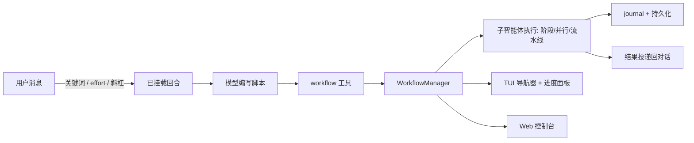

# omp-dynamic-workflows

面向 [omp](https://omp.sh)（`@oh-my-pi/pi-coding-agent`）的**脚本化子智能体编排**插件。一条工作流就是一段纯
JavaScript —— `agent()`、`parallel()`、`pipeline()`、阶段、重试、质量门禁 —— 在后台运行，实时投射到 TUI
或 React 控制台，并可保存为自己的斜杠命令。

由 `pi-dynamic-workflows` 迁移而来，完全对齐当前 `@oh-my-pi/*` 扩展 API。

- [环境要求](#环境要求) · [安装](#安装) · [快速上手](#快速上手)
- [斜杠命令](#斜杠命令) · [内置模式](#内置模式) · [工具接口](#工具接口)
- [编写工作流](#编写工作流) · [模型分层](#模型分层)
- [Web 控制台](#web-控制台) · [配置项](#配置项) · [环境变量](#环境变量) · [磁盘布局](#磁盘布局)
- [开发与验证](#开发与验证)

## 环境要求

| | |
|---|---|
| omp | `@oh-my-pi/pi-coding-agent` ≥ 17.2.4 且 < 17.3（peer 依赖，另含 `pi-ai` / `pi-tui` / `pi-utils`） |
| bun | 插件安装与控制台构建 |
| git | 仅 `isolation: "worktree"` 需要 |

peer 范围为 `>=17.2.4 <17.3`。**17.2.9 已实测兼容**：其 typebox shim 不认
`Type.Optional(Type.Unsafe(...))` 组合（`asRuntime(schema).or is not a function`，扩展加载即崩），
`workflow` 工具已改用 `Type.Object` 构造 args schema 规避，见 `src/workflow-tool.ts` 注释。

## 安装

```bash
omp plugin install github:ExLei/omp-dynamic-workflows
```

装完不需要再构建：React 控制台的产物已预构建并提交在 `web/dist`。`omp plugin install` 底层调用
`bun install <git spec>`，而 bun 只有在**消费方** `package.json` 的 `trustedDependencies` 里列出该依赖时，
才会执行 git 依赖的生命周期脚本 —— omp 的插件根目录并没有列，所以安装期的 `prepare` 构建会静默不执行。
`.github/workflows/web-dist.yml` 会在 `web/**` 变更时重新构建并提交 `web/dist`，因此发布的产物不会与源码漂移。

### 本地开发

```bash
bun install
omp plugin link .
```

清单通过 `omp.extensions` 暴露 `extensions/workflow.ts`，通过 `omp.skills` 附带 `workflow-authoring` 与
`workflow-patterns` 两个 skill。

## 快速上手

四种入口，从隐式到显式：

```bash
# 1. 关键词触发 —— 交互消息中出现独立词 `workflow`/`workflows` 时，
#    提交瞬间改写这条消息，强制本回合走工作流。
> 对比这两种设计方案，run a workflow

# 2. 常驻 effort —— 任何“实质性”消息（≥16 字符且不是斜杠命令）都自动挂载工作流。
#    仅本会话有效，永不落盘。
/effort ultra          # 或 /ultracode

# 3. 直接用一条精选模式
/deep-research X 和 Y 的取舍分别是什么？

# 4. 只为这一条提示词强制走一次工作流
/workflows run 审计 src/ 下所有重试路径
```

“挂载”只做**授权与引导**：本回合保留全部常规工具（模型往往需要先读代码），再额外加入 `workflow` 工具，
并在 `turn_end` 恢复原工具集。随后模型写出脚本并调用 `workflow`。运行默认在后台（headless 会话默认同步执行，
`background` 参数与 `syncMode` 设置可覆盖，见[工具接口](#工具接口)）—— `/workflows` 列出运行、
底部进度面板实时跟踪，运行结束后结果投递回对话。



## 斜杠命令

| 命令 | 参数 | 作用 |
|---|---|---|
| `/workflows` | *（无）* → 导航器 UI | 交互式运行列表与控制 |
| | `list` · `status <id>` · `watch <id>` | 查看运行 |
| | `pause <id>` · `resume <id>` · `stop <id>` · `rm <id>` | 控制运行 |
| | `run <prompt>` | 为 `<prompt>` 强制一次工作流回合 |
| | `save <name> [runId] [project\|user]` | 把某次运行的脚本保存为斜杠命令 |
| | `web [url]` | 打开控制台，或仅打印 URL |
| `/workflows-models` | *（无）* | 交互式模型分层编辑器（`small` / `medium` / `big`） |
| `/workflows-trigger` | `on` · `off` · `set <word>` · `reset` · `status` | 关键词触发偏好（持久化） |
| `/workflows-progress` | `compact` · `detailed` · `status` · `max <N>` | 底部进度面板（持久化） |
| `/effort` | `off` · `high` · `ultra` | 常驻自动挂载等级（仅本会话） |
| `/ultracode` | *（无）* = 开启 · `off` | `/effort ultra` 的别名 |
| `/deep-research`、`/adversarial-review`、`/code-review`、`/multi-perspective`、`/codebase-audit` | 见[内置模式](#内置模式) | 五个精选内置工作流 |
| `/<savedName>` | `key=value` 与位置参数 → `args` | 每个已保存工作流一条命令 |

`/code-review` 会自己取 diff：无参数 → `git diff HEAD`；纯数字 → `gh pr diff <n>`；`a..b` → 该区间；
其他 → 该路径在 HEAD 下的 diff。

已保存工作流在扩展加载时注册为命令，`/workflows save` 之后立即再注册一次。**同名已保存工作流会遮蔽内置模式**
（斜杠命令与工具 `name` 入参都遵循此优先级）。删除保存文件后，命令会残留到会话重载为止（宿主没有
`unregisterCommand`）。

## 内置模式

五条经过测试的精选工作流。每条既是斜杠命令，也可通过工具的 `name` + `args` 直接调用 —— 凡是能套进这些形状的
需求，都优先用它们，而不是重写一份等价脚本。

| `name` | 适用场景 | `args` |
|---|---|---|
| `deep-research` | 跨网检索一个问题并交叉核验来源 | `{ question, angles?=4, minSupport?=2 }` |
| `adversarial-review` | 先调查，再由怀疑派审阅者逐条交叉核验 | `{ task, reviewers?, threshold? }` |
| `code-review` | 多视角 diff 评审（正确性、复用、简化、效率、抽象层次） | `{ diff, diffSource? }` —— diff 需自行获取 |
| `multi-perspective` | 多个独立视角并行分析后综合 | `{ topic, perspectives? }`（默认：技术、产品、安全、用户体验、可维护性） |
| `codebase-audit` | 针对某范围并行检查后交叉验证 | `{ scope, checks[] }` |

这五个名字只在工具顶层 `name` 生效。脚本内的 `workflow(name, args)` 只解析**已保存**工作流，不解析内置模式。

## 工具接口

两个工具在扩展加载时注册，并在 `session_start` 激活。子智能体永远看不到它们（`workflow` 与
`workflow_control` 始终从子会话工具集中排除），因此工作流无法再嵌套派生工作流。

### `workflow`

| 字段 | 类型 | 默认值 | 含义 |
|---|---|---|---|
| `script` | string | — | 工作流 JS。未提供 `name` 时必填 |
| `name` | string | — | 按名字运行已保存或内置工作流（已保存优先）。不能与 `resumeFromRunId` 同用 |
| `args` | object | — | 绑定到脚本的 `args` 全局 |
| `background` | boolean | 随上下文 | 默认：TUI 会话（有 UI）为 `true`，后台运行返回 run id；headless 会话为 `false`，阻塞并内联返回结果。优先级：显式 `background` > `options.syncMode` > 设置里的 `syncMode` > 上下文默认 |
| `maxAgents` | number | 上限 1000 | 本次运行的智能体硬上限 |
| `concurrency` | number | 8（最大 16） | 同时在飞的智能体数 |
| `agentRetries` | number | 0（最大 3） | **可恢复**失败后的重试次数 |
| `agentTimeoutMs` | number | 无 | 单个智能体超时 |
| `tokenBudget` | number | 无 | 软性花费闸门 —— 必须显式指定，绝不推断 |
| `resumeFromRunId` | string | — | 恢复此前运行（可换用改过的脚本）；始终后台 |

`maxAgents` / `concurrency` / `agentRetries` / `agentTimeoutMs` / `tokenBudget` 在运行开始（以及恢复）时
被冻结到该运行上，因此恢复的运行仍沿用起始时的限额。

### `workflow_control`

`{ action, runId? }` —— 除 `list` 外都必须给 `runId`。

| `action` | 返回 |
|---|---|
| `list` | `{ runs: [{ runId, workflowName, status, phase, counts{total,done,running,queued,error,skipped}, activeLabels, tokenTotal }] }` |
| `status` | 单个运行的同结构摘要 |
| `pause` / `resume` / `stop` | `{ result: "paused" \| "resumed" \| "stopped", run }` |

出错时返回 `allowedActions`：`running` → status/pause/stop · `paused` → status/resume/stop ·
`failed`/`pending` → status/resume · `completed`/`aborted` → status。手动停止落为 `stopped`/`aborted`，
不会记成错误。

## 编写工作流

改动工作流 JS 前请先加载随包的 **workflow-authoring** skill —— 那里有完整契约、配方与评审清单。核心如下：

```javascript
export const meta = {
  name: "fan_out_and_synthesize",
  description: "Run bounded independent work, retain a complete coverage ledger, then synthesize",
  phases: [{ title: "Fan out" }, { title: "Synthesize" }],
};

// ADAPT: validate and bound args.work for the task before invoking this workflow.
const work = args && Array.isArray(args.work) ? args.work : [];

phase("Fan out");
const fanOutResults = await parallel(
  work.map((unit, index) => () =>
    agent(
      `Complete this independent work unit. Return only evidence relevant to it.\n\n${JSON.stringify(unit)}`,
      // INVARIANT: index plus a stable task-owned id keeps labels unique.
      { label: `fanout:${index}:${String(unit.id)}` },
    ),
  ),
);

// INVARIANT: preserve every intended identity before filtering or synthesis.
const ledger = work.map((unit, index) => ({
  id: String(unit.id),
  status: fanOutResults[index] === null ? "failed" : "complete",
  result: fanOutResults[index],
}));

phase("Synthesize");
const synthesis = await agent(
  `Synthesize the complete fan-out ledger below. Distinguish covered work from failed/missing coverage; do not invent results.\n\n${JSON.stringify(ledger)}`,
  {
    label: "synthesize-complete-set",
    // ADAPT: keep the schema small and aligned with downstream field access.
    schema: {
      type: "object",
      properties: {
        summary: { type: "string" },
        coveredIds: { type: "array", items: { type: "string" } },
        failedIds: { type: "array", items: { type: "string" } },
      },
      required: ["summary", "coveredIds", "failedIds"],
    },
  },
);

// INVARIANT: return plain serializable data, including missing-coverage identities.
return { ledger, synthesis };
```

*（逐字取自 `skills/workflow-authoring/examples/fan-out-and-synthesize.js`）*

### 脚本契约

- 首条语句必须是字面量 `export const meta = { name, description, phases?, model? }`。
- 至少调用一次 `agent()`；每次调用给一个简短唯一的 `label`；显式 `return` 可 JSON 序列化的纯数据 ——
  不能含函数、Promise、循环引用、BigInt 或句柄。
- 纯 JavaScript：不能 `import`/`require`，不能碰文件系统。不确定性只能经 `args` 传入；`Date.now()`、
  `Math.random()`、无参 `new Date()` 已被屏蔽。
- 可恢复的智能体失败会解析为 `null`，而不是抛错。**先**把结果与稳定的工作 ID 配对再过滤，并把缺失覆盖如实报出，
  不要悄悄丢掉。

### 运行时全局

| 全局 | 签名 |
|---|---|
| `agent` | `agent(prompt, options?) → Promise<string \| 结构化 \| null>` |
| `parallel` | `parallel(thunks) → Promise<Array<unknown \| null>>` —— 传函数不是 Promise；保持顺序 |
| `pipeline` | `pipeline(items, ...stages) → Promise<Array<unknown \| null>>` —— items 并发、stages 串行；stage 参数 `(prev, item, index)` |
| `workflow` | `workflow(savedName, childArgs?) → Promise<unknown>` —— 只允许一层嵌套；共享限流器、计数、预算与 store |
| `verify` | `verify(item, { reviewers?=2, threshold?=0.5, lens? }) → { real, realCount, total, votes }` |
| `judgePanel` | `judgePanel(attempts, { judges?=3, rubric? }) → { index, attempt, score, judgments } \| undefined` |
| `loopUntilDry` | `loopUntilDry({ round, key?, consecutiveEmpty?=2, maxRounds?=50 }) → unknown[]` |
| `completenessCheck` | `completenessCheck(taskArgs, results) → { complete, missing? } \| null` |
| `retry` | `retry(thunk, { attempts?=3, until? }) → unknown` —— `until` 必须同步 |
| `gate` | `gate(thunk, validator, { attempts?=3 }) → { ok, value, attempts }` —— validator 需返回 `{ ok }` |
| `checkpoint` | `checkpoint(prompt, { default?, headless?, kind?, choices?, timeoutMs? }) → unknown` |
| `phase` | `phase(title, { budget? })` —— 声明当前阶段，可带软性子预算 |
| `log` | `log(message)` —— 新代码用它；`console.*` 仅为兼容保留 |
| `args`、`cwd`、`process`、`budget` | 调用参数 · 运行 cwd · `{ cwd() }` · `{ total, spent(), remaining() }`（软性记账） |

`checkpoint` 的 `confirm` 与 headless 路径已实现；`kind: "input" \| "select"` 和 `timeoutMs` 仅在契约中声明、
尚未接通 —— 不要依赖。

运行级共享存储**不是**脚本全局。智能体拿到的是 `store_put` / `store_get` 工具，跨智能体状态经由**智能体**写入
的 store 流转，脚本侧读不到。

### `agent()` 选项

| 选项 | 类型 | 含义 |
|---|---|---|
| `label` | string | 展示/journal 标签；简短且唯一 |
| `phase` | string | 覆盖当前阶段 |
| `schema` | JSON Schema | 结构化输出；顶层必须是 `type: "object"`，返回已解析对象 |
| `model` | string | 精确 `provider/modelId`（或裸 id）—— 优先级最高 |
| `tier` | string | 已配置的分层名（`small` / `medium` / `big`） |
| `agentType` | string | 具名智能体定义（`.omp/agents` 或用户目录）：工具、模型、提示词 |
| `isolation` | `"worktree"` | 尽力创建 git worktree；失败会记录日志并继续（不隔离） |
| `timeoutMs` | number \| null | 单智能体超时；`null` 关闭 |
| `retries` | number | 单智能体可恢复重试（0–3）；**覆盖**本次调用的 `agentRetries` |

模型选择优先级从高到低：`model` → `agentType` 的模型 → `tier` → 阶段模型 → `meta.model` → 隐式 `medium`
→ 会话默认。**显式指定**却不可用的模型会抛 `MODEL_NOT_FOUND`，不做静默降级；只有*隐式*默认档会退回会话模型，
并给一次性告警。结构化输出走 `structured_output` 工具，带 2 次修复重试；最终仍不合规视为不可恢复。

### 子智能体会话

每次 `agent()` 调用都是一个受限的 omp 子会话：默认编码工具集，加上运行级的 `store_put` / `store_get`，
并且 `workflow` 与 `workflow_control` 始终禁用（`excludeSubagentTools` 里列出的也一并禁用）。运行也可以带一个
具名 **toolset** —— `/deep-research` 用的是 `web-research`，它额外提供真实的 `web_search` / `web_fetch`
（在扩展宿主进程内执行网络请求）；该 tag 会随运行持久化，因此恢复的运行仍保有这些工具，不会静默退化。
`agentType` 会按其定义的 `tools` / `disallowedTools` 进一步收窄。子会话记录默认不落盘，除非开启
`persistAgentSessions`。

### 保存

`/workflows save <name> [runId] [project|user]`，或控制台的 Save 按钮，会把 `<name>.js` 写入所选作用域并
立刻注册斜杠命令：

| 作用域 | 路径 | 说明 |
|---|---|---|
| `project`（默认） | `<cwd>/.omp/workflows/saved/` | 可提交，团队共享 |
| `user` | `~/.omp/workflows/saved/` | 个人，全项目可用 |

加载优先级：项目内 → 历史遗留的 home 项目目录 → 用户级。

## 模型分层

一个 tier 就是一个具名槽位，只放一个模型规格（允许 `:thinking` 后缀），存于
`~/.omp/workflows/model-tiers.json`：

```json
{ "tiers": { "small": "…", "medium": "…", "big": "…" } }
```

`/workflows-models` 打开该文件的编辑器；磁盘上没有文件时，它会基于你可用的模型（按价格、再按名称线索排序）
给出建议映射，并标记为未保存。**在真正保存之前**，`opts.tier` 会退回会话模型，并给出告警：

> `[workflow] An agent requested opts.tier but no model-tiers.json is configured, so tiers currently fall back to <model>. Run /workflows-models to configure them`

配置有效后，未标注分层的智能体默认走 `medium`。

## Web 控制台

一套 React/Vite UI，直接架在**活的** `WorkflowManager` 之上 —— 与 TUI 导航器、任务面板同一个实例，
因此运行、快照、暂停/恢复/停止是共享的，不是镜像同步。

产物随插件发布，安装无需构建。改完 `web/src` 用 `bun run web:build` 刷新（CI 在 `main` 上做同样的事）；
`OMP_WORKFLOW_WEB_ROOT` 可覆盖被托管的目录。

### 怎么打开

| | |
|---|---|
| `/workflows web` | 用默认浏览器打开控制台 |
| `/workflows web url` | 只打印 URL —— 适合 SSH 或粘到另一台机器 |
| 会话启动 | 打印 `Workflow web console: http://127.0.0.1:<port>/?token=…  (/workflows web to open)` |
| `"web": { "open": true }` | 每次会话启动自动开浏览器 |

URL 携带**进程级** token，每次启动都变，且无法从磁盘恢复 —— 启动提示滚走之后，`/workflows web` 是唯一的回路。
自动打开默认关闭：在每个仓库的每次 `omp` 都弹浏览器是骚扰，在 SSH 下更是错的（opener 会检测
`SSH_CONNECTION`/无 `DISPLAY`，并提示你改用 URL）。

### 为什么它敢默认开启

在本仓库实测，控制台给启动增加约 **3ms**：模块求值 ~2.5–3.2ms 加环回绑定 ~0.5ms，对比 omp 约 2.9s 的启动。
`omp -p "" --no-session` 的 A/B（各 7 次）给出的差值是 −3ms/+22ms —— 落在抖动区间内。靠三条规则守住，
`tests/web-startup-budget.test.ts` 一旦被破坏就构建失败：

1. 入口通过**动态且从不 await** 的 `import()` 拿到服务器，并推迟到 `session_start` 之后一个宏任务 ——
   首屏之前不挡任何东西。
2. 服务器的模块图被钉在插件本来就会加载的模块上。新增一个 `@oh-my-pi/pi-coding-agent` 的值导入要付
   ~1.4s（见 `src/omp-host.ts`）。
3. React 资源根目录在**首个浏览器请求**时才 stat，而不是绑定时；没人打开控制台的会话不会多碰任何文件。

889KB 的 bundle 故意**不做**代码分割：环回传输 5.4ms（FCP 164ms），而编辑器和两张图在首屏即可见，
懒加载分块只会多闪一下。

### 界面能看到什么

实时运行列表；一张运行时拓扑图 —— 阶段是容器，装着它**实际产生**的智能体（由真实 `agentStart`/`agentEnd`
事件构建）；日志；SSE 事件流；以及运行的返回值。点任意智能体（图上或表里）会从右侧抽屉展开它**未裁剪**的
完整记录，运行期间由 `/api/runs/:id/agents/:id` 实时刷新；快照推送保持裁剪，避免大扇出在每个 tick 重播全部记录。

编写区是 CodeMirror JS 编辑器，编辑的就是工具与斜杠命令实际运行的那份脚本 —— 没有降级的图形 DSL ——
旁边配一张**尽力而为**的静态结构图：包含关系画成嵌套（`phase` 拥有其后的调用，`parallel` 块拥有其分支），
执行顺序画成兄弟节点间的箭头，扇出只能在运行时确定的部分用虚线。点节点会在编辑器里定位到对应调用。

每个区域都是可拖拽调整的窗格，布局按分组持久化在 `localStorage`。保存时会询问项目级还是个人级作用域，
并立即注册斜杠命令。

### HTTP API

只绑环回，且所有 `/api/*` 都必须带 token（`?token=`、`x-workflow-token:` 或
`Authorization: Bearer`）—— 因为启动一次运行就等于在 omp 进程内执行任意 JS。

| 路由 | 用途 |
|---|---|
| `GET /api/state` | cwd、运行摘要、已保存工作流、内置模式 |
| `GET /api/events` | SSE 快照/事件流 |
| `POST /api/parse` | 解析脚本 → meta + 静态大纲 |
| `POST /api/runs` | 启动运行 |
| `GET /api/runs/:id` | 状态、脚本、args、快照、结果 |
| `DELETE /api/runs/:id` | 删除运行 |
| `POST /api/runs/:id/{pause,resume,stop}` | 控制 |
| `GET /api/runs/:id/agents/:agentId` | 单个智能体的未裁剪记录 |
| `GET /api/save-locations?name=` | 可用保存作用域，以及哪些已占用该名字 |
| `POST /api/saved` | 保存工作流（与工具路径同样校验） |

从浏览器启动的运行会写入 transcript，但以 `triggerTurn: false` 投递 —— 在 Web UI 点 Run 只记录上下文，
不会把 TUI 里的助手唤起成一次未经请求（且要计费）的回合。

### 前端开发

```bash
bun run spike:web   # 独立 manager + 模拟智能体，端口 7788
bun run web:dev     # Vite 跑 :5178，把 /api 代理到 :7788
```

## 配置项

`~/.omp/workflows/settings.json`，再被 `~/.omp/workflows/projects/<key>/settings.json` **浅覆盖**
（项目设置放在机器本地的 workflow home，按 cwd 派生 key —— 不在仓库里）。项目级的 `web` 对象会**整体替换**
全局的，不做深合并。未知键被丢弃；文件损坏视为 `{}`。

| 键 | 类型 | 默认值 |
|---|---|---|
| `keywordTriggerEnabled` | boolean | `true` |
| `keywordTriggerWord` | string（不能以 `/` 开头，不能含空白） | `"workflow"`（默认词同时匹配 `workflows`） |
| `defaultAgentTimeoutMs` | number \| null | `null`（无硬超时） |
| `defaultTokenBudget` | 整数 ≥1 \| null | `null`（不限） |
| `defaultConcurrency` | 1–16 | `8` |
| `defaultAgentRetries` | 0–3 | `0` |
| `progressPanelMode` | `"compact"` \| `"detailed"` | `"compact"` |
| `progressPanelMaxAgents` | ≥1（上限 1000） | `8` |
| `persistAgentSessions` | boolean | `false` |
| `deliveredResultMaxChars` | 1–1000000 | `400` |
| `excludeSubagentTools` | string[] | `[]`（叠加在始终排除的编排工具之上） |
| `syncMode` | `"auto"` \| `"always"` \| `"never"` | `"auto"` | 控制 `workflow` 工具 `background` 默认：`auto` 随会话形态（TUI 有 UI → 后台；headless → 同步）；`always` 强制同步；`never` 强制后台 |
| `web.enabled` | boolean | `true`（只有显式 `false` 才关闭） |
| `web.port` | 1–65535 | `0`（临时端口） |
| `web.announce` | boolean | `true` |
| `web.open` | boolean | `false` |

优先级：全局文件 → 项目文件 → `OMP_WORKFLOW_WEB`（仅 web 相关键）→ 单次运行的工具入参
（`concurrency`、`agentTimeoutMs` 等）。

```json
{
  "keywordTriggerWord": "workflow",
  "defaultConcurrency": 8,
  "defaultAgentRetries": 1,
  "syncMode": "auto",
  "progressPanelMode": "detailed",
  "web": { "enabled": true, "port": 0, "announce": true, "open": false }
}
```

## 环境变量

| 变量 | 取值 | 效果 |
|---|---|---|
| `OMP_WORKFLOW_WEB` | `0`/`false`/`off` 关闭；2–65535 的整数固定该端口；其他非空值 → 启用并用临时端口 | 单次启动覆盖 `web.enabled` / `web.port` |
| `OMP_WORKFLOW_WEB_TOKEN` | 任意字符串 | 跨重启复用控制台 token（否则每进程随机 24 字节） |
| `OMP_WORKFLOW_WEB_ROOT` | 含 `index.html` 的目录 | 托管该 UI 根目录，替代内置 `web/dist` |
| `SSH_CONNECTION`、`SSH_TTY`、`DISPLAY`、`WAYLAND_DISPLAY` | 只读 | 判断能否打开浏览器 |

## 磁盘布局

| 路径 | 内容 |
|---|---|
| `~/.omp/workflows/settings.json` | 用户设置 |
| `~/.omp/workflows/model-tiers.json` | 模型分层 |
| `~/.omp/workflows/saved/` | 个人已保存工作流（`<name>.js`） |
| `~/.omp/workflows/projects/<basename>-<sha256[0:12]>/` | 机器本地、按 cwd 划分的根目录 |
| `…/settings.json` | 项目设置覆盖 |
| `…/runs/<runId>.json`（及 `.bak`、`.lock`、`.log`） | 运行状态（内嵌恢复 journal）、原子写备份、跨进程租约锁、可选文件日志 |
| `<cwd>/.omp/workflows/saved/` | 可提交的项目级已保存工作流 |
| `<repoRoot>/.omp/worktrees/<slug>` | 智能体隔离用 worktree，分支 `omp/wf/<slug>` |
| `.omp/agents` | 供 `agentType` 使用的项目级具名智能体定义 |

磁盘上的终态运行默认保留 300 条，超出按最旧优先清理。

## 开发与验证

```bash
bun run check       # tsc --noEmit
bun test            # tests/
bun run build       # tsc -p tsconfig.build.json
bun run web:build   # 构建控制台 → web/dist
```

| 测试 | 守护的契约 |
|---|---|
| `omp-integration.test.ts` | 清单/扩展发现、工具与命令面、`.omp/workflows` 命名空间、智能体身份隔离 |
| `run-persistence.test.ts` | 机器本地 runs 目录的存/取/列/删、租约，且运行数据不写入仓库 `.omp` |
| `save-location.test.ts` | 项目级 vs 用户级保存目录、遗留 home 目录仍可读、展示路径 |
| `web-server.test.ts` | 环回 API 鉴权、运行控制、保存位置 |
| `web-startup-budget.test.ts` | 服务器只能经动态 import 到达；`OMP_WORKFLOW_WEB` 语义 |
| `stop-semantics.test.ts` | 手动停止落为 `stopped`/`aborted` 而非 `error` |
| `panel-ui.test.ts` | 紧凑面板的 spinner/耗时、导航器与保存位置文案 |
| `schema-coercion.test.ts` | 结构化输出的 TypeBox convert/check 强制转换 |
| `live-usage.test.ts` | 经 workflow 与 manager 的 token 用量聚合 |
| `js-save.test.ts` | 已保存工作流（`.js`）的作用域存/取与脚本解析校验 |
| `subagent-sync.test.ts` | 子智能体会话同步：`syncHostTools` 三选项、MCP 白名单收窄与降级 |
| `workflow-tool-sync.test.ts` | `workflow` 工具 `background` 默认值随会话形态，`syncMode` 优先级链 |
| `workflow-watch.test.ts` | `/workflows watch` 输出通道：headless 流式消息、UI 会话状态栏 |
| `zh-copy.test.ts` | 源码与 Web 控制台的全部工具描述、提示词与 UI 文案为中文 |
