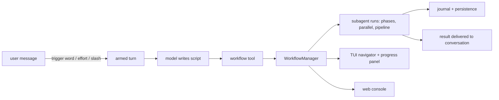

# omp-dynamic-workflows

Script-defined subagent orchestration for [omp](https://omp.sh) (`@oh-my-pi/pi-coding-agent`). A
workflow is plain JavaScript — `agent()`, `parallel()`, `pipeline()`, phases, retries,
quality gates — that runs in the background, streams into the TUI or a React console, and
can be saved as its own slash command.

Ported from `pi-dynamic-workflows` onto the current `@oh-my-pi/*` extension APIs.

**[中文文档 / Chinese README](README.zh-CN.md)**

- [Requirements](#requirements) · [Install](#install) · [Quick start](#quick-start)
- [Slash commands](#slash-commands) · [Built-in patterns](#built-in-patterns) · [Tools](#tools)
- [Authoring a workflow](#authoring-a-workflow) · [Model tiers](#model-tiers)
- [Web console](#web-console) · [Settings](#settings) · [Environment](#environment-variables) · [On disk](#on-disk-layout)
- [Development](#development)

## Requirements

| | |
|---|---|
| omp | `@oh-my-pi/pi-coding-agent` ≥ 17.2.4 (peer dependency, with `pi-ai` / `pi-tui` / `pi-utils`) |
| bun | plugin install and the console build |
| git | only for `isolation: "worktree"` |

## Install

```bash
omp plugin install github:zerx-lab/omp-dynamic-workflows
```

Nothing to build afterwards: the React console is committed pre-built under `web/dist`.
`omp plugin install` shells out to `bun install <git spec>`, and bun refuses to run a git
dependency's lifecycle scripts unless the *consuming* `package.json` lists it in
`trustedDependencies` — omp's plugins root does not, so an install-time `prepare` build
would silently never run. The `.github/workflows/web-dist.yml` job rebuilds and commits
`web/dist` whenever `web/**` changes, so the shipped bundle cannot drift from the sources.

### Local development

```bash
bun install
omp plugin link .
```

The manifest exposes `extensions/workflow.ts` through `omp.extensions` and bundles the
`workflow-authoring` and `workflow-patterns` skills through `omp.skills`.

## Quick start

Four ways in, from implicit to explicit:

```bash
# 1. Trigger word — any interactive message containing the bounded word
#    `workflow`/`workflows` is rewritten at submit time to force a workflow turn.
> compare these two designs, run a workflow

# 2. Standing effort — auto-arms every substantive message (≥16 chars, not a slash
#    command). Session-only, never persisted.
/effort ultra          # or /ultracode

# 3. A curated pattern, straight to the point
/deep-research What are the tradeoffs of X vs Y?

# 4. Force exactly one workflow turn for this prompt
/workflows run audit the retry paths in src/
```

Arming only *authorizes and nudges* the model: the turn keeps every normal tool (so it can
read the repo first) plus the `workflow` tool, and the tool set is restored on `turn_end`.
The model then writes a script and calls `workflow`. Runs are background by default —
`/workflows` lists them, the bottom progress panel tracks them live, and the result is
delivered into the conversation when the run settles.



## Slash commands

| Command | Arguments | Purpose |
|---|---|---|
| `/workflows` | *(none)* → navigator UI | Interactive run list / control |
| | `list` · `status <id>` · `watch <id>` | Inspect runs |
| | `pause <id>` · `resume <id>` · `stop <id>` · `rm <id>` | Control runs |
| | `run <prompt>` | Force one workflow turn for `<prompt>` |
| | `save <name> [runId] [project\|user]` | Save a run's script as a slash command |
| | `web [url]` | Open the console, or print its URL only |
| `/workflows-models` | *(none)* | Interactive model-tier editor (`small` / `medium` / `big`) |
| `/workflows-trigger` | `on` · `off` · `set <word>` · `reset` · `status` | Keyword-trigger preferences (persisted) |
| `/workflows-progress` | `compact` · `detailed` · `status` · `max <N>` | Bottom progress panel (persisted) |
| `/effort` | `off` · `high` · `ultra` | Standing auto-arm level (session-only) |
| `/ultracode` | *(none)* = on · `off` | Alias for `/effort ultra` |
| `/deep-research`, `/adversarial-review`, `/code-review`, `/multi-perspective`, `/codebase-audit` | see [patterns](#built-in-patterns) | The five curated built-ins |
| `/<savedName>` | `key=value` tokens and positionals → `args` | One command per saved workflow |

`/code-review` resolves its diff for you: no argument → `git diff HEAD`, digits → `gh pr
diff <n>`, `a..b` → that range, anything else → that path under HEAD.

Saved workflows are registered as commands at extension load and again right after
`/workflows save`. A saved workflow **shadows a built-in of the same name**, on the slash
command and through the tool's `name` input. Deleting a save leaves the command registered
until the session reloads (the host has no `unregisterCommand`).

## Built-in patterns

Five curated, tested workflows. Each is a slash command *and* reachable from the tool with
`name` + `args` — prefer them over writing an equivalent script from scratch.

| `name` | Use for | `args` |
|---|---|---|
| `deep-research` | A question researched across the web with cross-checked sources | `{ question, angles?=4, minSupport?=2 }` |
| `adversarial-review` | Investigate, then have skeptical reviewers cross-check each finding | `{ task, reviewers?, threshold? }` |
| `code-review` | Multi-angle diff review (correctness, reuse, simplification, efficiency, altitude) | `{ diff, diffSource? }` — fetch the diff yourself |
| `multi-perspective` | Independent perspectives in parallel, then synthesis | `{ topic, perspectives? }` (default: technical, product, security, UX, maintainability) |
| `codebase-audit` | Parallel checks over a scope, then cross-validation | `{ scope, checks[] }` |

These five names live at the tool's top-level `name` only. The in-script
`workflow(name, args)` helper resolves **saved** workflows, not built-ins.

## Tools

Both tools are registered at load and activated on `session_start`. Subagents never see
them (`workflow` and `workflow_control` are always excluded from child sessions), so a
workflow cannot spawn workflows.

### `workflow`

| Field | Type | Default | Meaning |
|---|---|---|---|
| `script` | string | — | The workflow JS. Required unless `name` is set |
| `name` | string | — | Run a saved or built-in workflow by name (saved wins). Not with `resumeFromRunId` |
| `args` | object | — | Bound to the script's `args` global |
| `background` | boolean | `true` | Background returns a run id; `false` blocks and returns the value inline |
| `maxAgents` | number | ceiling 1000 | Hard cap on agents for the run |
| `concurrency` | number | 8 (max 16) | Max agents in flight |
| `agentRetries` | number | 0 (max 3) | Retries after a *recoverable* agent failure |
| `agentTimeoutMs` | number | none | Per-agent timeout |
| `tokenBudget` | number | none | Soft spend gate — opt-in, never inferred |
| `resumeFromRunId` | string | — | Resume a prior run, optionally with an edited script; always background |

`maxAgents` / `concurrency` / `agentRetries` / `agentTimeoutMs` / `tokenBudget` are frozen
on the run at start (and at resume), so a resumed run keeps the limits it began with.

### `workflow_control`

`{ action, runId? }` — `runId` is required for everything except `list`.

| `action` | Returns |
|---|---|
| `list` | `{ runs: [{ runId, workflowName, status, phase, counts{total,done,running,queued,error,skipped}, activeLabels, tokenTotal }] }` |
| `status` | that summary for one run |
| `pause` / `resume` / `stop` | `{ result: "paused" \| "resumed" \| "stopped", run }` |

Errors carry `allowedActions`: `running` → status/pause/stop · `paused` → status/resume/stop
· `failed`/`pending` → status/resume · `completed`/`aborted` → status. A manual stop settles
as `stopped`/`aborted`, never as an error.

## Authoring a workflow

Load the bundled **workflow-authoring** skill before writing or editing workflow JS; it
carries the exhaustive contract, recipes, and a review checklist. The essentials:

```javascript
export const meta = {
  name: "fan_out_and_synthesize",
  description: "Run bounded independent work, retain a complete coverage ledger, then synthesize",
  phases: [{ title: "Fan out" }, { title: "Synthesize" }],
};

// ADAPT: validate and bound args.work for the task before invoking this workflow.
const work = args && Array.isArray(args.work) ? args.work : [];

phase("Fan out");
const fanOutResults = await parallel(
  work.map((unit, index) => () =>
    agent(
      `Complete this independent work unit. Return only evidence relevant to it.\n\n${JSON.stringify(unit)}`,
      // INVARIANT: index plus a stable task-owned id keeps labels unique.
      { label: `fanout:${index}:${String(unit.id)}` },
    ),
  ),
);

// INVARIANT: preserve every intended identity before filtering or synthesis.
const ledger = work.map((unit, index) => ({
  id: String(unit.id),
  status: fanOutResults[index] === null ? "failed" : "complete",
  result: fanOutResults[index],
}));

phase("Synthesize");
const synthesis = await agent(
  `Synthesize the complete fan-out ledger below. Distinguish covered work from failed/missing coverage; do not invent results.\n\n${JSON.stringify(ledger)}`,
  {
    label: "synthesize-complete-set",
    // ADAPT: keep the schema small and aligned with downstream field access.
    schema: {
      type: "object",
      properties: {
        summary: { type: "string" },
        coveredIds: { type: "array", items: { type: "string" } },
        failedIds: { type: "array", items: { type: "string" } },
      },
      required: ["summary", "coveredIds", "failedIds"],
    },
  },
);

// INVARIANT: return plain serializable data, including missing-coverage identities.
return { ledger, synthesis };
```

*(verbatim from `skills/workflow-authoring/examples/fan-out-and-synthesize.js`)*

### Script contract

- First statement is a literal `export const meta = { name, description, phases?, model? }`.
- Call `agent()` at least once, give every call a short unique `label`, and `return` plain
  JSON-serializable data — no functions, promises, cycles, BigInt, or handles.
- Plain JavaScript: no `import`/`require`, no filesystem. Nondeterminism arrives through
  `args`; `Date.now()`, `Math.random()`, and no-argument `new Date()` are neutered.
- A recoverable agent failure resolves to `null`, not a throw. Pair results with stable
  work IDs *before* filtering, and report missing coverage instead of dropping it.

### Runtime globals

| Global | Signature |
|---|---|
| `agent` | `agent(prompt, options?) → Promise<string \| structured \| null>` |
| `parallel` | `parallel(thunks) → Promise<Array<unknown \| null>>` — thunks, not promises; order preserved |
| `pipeline` | `pipeline(items, ...stages) → Promise<Array<unknown \| null>>` — items concurrent, stages sequential; stage args `(prev, item, index)` |
| `workflow` | `workflow(savedName, childArgs?) → Promise<unknown>` — one nesting level; shares limiter, counters, budget, store |
| `verify` | `verify(item, { reviewers?=2, threshold?=0.5, lens? }) → { real, realCount, total, votes }` |
| `judgePanel` | `judgePanel(attempts, { judges?=3, rubric? }) → { index, attempt, score, judgments } \| undefined` |
| `loopUntilDry` | `loopUntilDry({ round, key?, consecutiveEmpty?=2, maxRounds?=50 }) → unknown[]` |
| `completenessCheck` | `completenessCheck(taskArgs, results) → { complete, missing? } \| null` |
| `retry` | `retry(thunk, { attempts?=3, until? }) → unknown` — `until` is sync |
| `gate` | `gate(thunk, validator, { attempts?=3 }) → { ok, value, attempts }` — validator returns `{ ok }` |
| `checkpoint` | `checkpoint(prompt, { default?, headless?, kind?, choices?, timeoutMs? }) → unknown` |
| `phase` | `phase(title, { budget? })` — declares the current phase, optional soft sub-budget |
| `log` | `log(message)` — use this; `console.*` is compatibility-only |
| `args`, `cwd`, `process`, `budget` | invocation args · run cwd · `{ cwd() }` · `{ total, spent(), remaining() }` (soft accounting) |

`checkpoint`'s `confirm` and headless paths are implemented; `kind: "input" \| "select"` and
`timeoutMs` are declared in the contract but not wired — don't rely on them.

The run-scoped shared store is **not** a script global. Agents get `store_put` / `store_get`
tools instead, so cross-agent state passes through the store the *agents* write, not through
script-side reads.

### `agent()` options

| Option | Type | Meaning |
|---|---|---|
| `label` | string | Display/journal label; keep it short and unique |
| `phase` | string | Overrides the current phase |
| `schema` | JSON Schema | Structured output; must be a top-level `type: "object"`. Returns a parsed object |
| `model` | string | Exact `provider/modelId` (or bare id) — highest priority |
| `tier` | string | A configured tier name (`small` / `medium` / `big`) |
| `agentType` | string | A named agent definition (`.omp/agents` or the user agent dir): tools, model, prompt |
| `isolation` | `"worktree"` | Best-effort git worktree; failure logs and continues un-isolated |
| `timeoutMs` | number \| null | Per-agent timeout; `null` disables it |
| `retries` | number | Per-agent recoverable retries (0–3); overrides the invocation's `agentRetries` |

Model selection, highest first: `model` → `agentType` model → `tier` → phase model →
`meta.model` → implicit `medium` → session default. An explicitly named model that is
unavailable raises `MODEL_NOT_FOUND` — only the *implicit* default degrades to the session
model, with a one-time warning. Structured output uses a `structured_output` tool with 2
repair retries; final non-compliance is non-recoverable.

### Subagent sessions

Each `agent()` call is a restricted omp child session: the default coding tools plus the
run-scoped `store_put` / `store_get`, with `workflow` and `workflow_control` always denied
(and anything else listed in `excludeSubagentTools`). A run may carry a named *toolset*
instead — `/deep-research` runs on `web-research`, which adds real `web_search` / `web_fetch`
tools executed in the extension host, and the tag is persisted so a resumed run keeps them
rather than silently degrading. `agentType` narrows further, per that definition's
`tools` / `disallowedTools`. Child transcripts are discarded unless
`persistAgentSessions` is on.

### Saving

`/workflows save <name> [runId] [project|user]`, or the console's Save button, writes
`<name>.json` to either scope and registers the slash command immediately:

| Scope | Path | Notes |
|---|---|---|
| `project` (default) | `<cwd>/.omp/workflows/saved/` | Committable, shared with the team |
| `user` | `~/.omp/workflows/saved/` | Personal, all projects |

Load precedence: in-project → legacy per-project home dir → user.

## Model tiers

A tier is a named slot holding exactly one model spec (a `:thinking` suffix is allowed),
stored in `~/.omp/workflows/model-tiers.json`:

```json
{ "tiers": { "small": "…", "medium": "…", "big": "…" } }
```

`/workflows-models` opens an editor over that file; with no file on disk it shows a
suggested mapping derived from your available models (ranked by price, then name hints) and
marks it dirty until you save. Until it *is* saved, `opts.tier` falls back to the session
model and the run warns:

> `[workflow] An agent requested opts.tier but no model-tiers.json is configured, so tiers currently fall back to <model>. Run /workflows-models to configure them`

With a valid config, untagged agents default to the `medium` tier.

## Web console

A React/Vite UI over the **live** `WorkflowManager` — the same instance the TUI navigator
and task panel use, so runs, snapshots, and pause/resume/stop are shared, not mirrored.

The bundle ships with the plugin, so an install needs no build step. After editing
`web/src`, refresh it with `bun run web:build` (CI does the same on `main`);
`OMP_WORKFLOW_WEB_ROOT` overrides the served directory.

### Opening it

| | |
|---|---|
| `/workflows web` | opens the console in your default browser |
| `/workflows web url` | prints the URL only — SSH, or pasting into another machine |
| session start | prints `Workflow web console: http://127.0.0.1:<port>/?token=…  (/workflows web to open)` |
| `"web": { "open": true }` | opens the browser automatically on every session start |

The URL carries a per-process token, so it changes every launch and is not recoverable from
disk — `/workflows web` is the way back to it after the startup notice scrolls away.
Auto-open stays off by default: launching a browser on every `omp` in every repo is hostile,
and over SSH it is simply wrong (the opener detects `SSH_CONNECTION`/no `DISPLAY` and tells
you to use the URL instead).

### Why it can be on by default

Measured on this repo, the console adds **~3ms** to launch: ~2.5–3.2ms of module evaluation
plus ~0.5ms for the loopback bind, against omp's ~2.9s startup. An A/B over
`omp -p "" --no-session` (7 runs each) puts the delta at −3ms/+22ms — inside run-to-run
noise. Three rules keep it there, and `tests/web-startup-budget.test.ts` fails the build if
any of them is broken:

1. The entry reaches the server through a **dynamic, never-awaited** `import()`, deferred
   one macrotask past `session_start` — nothing sits before first paint.
2. The server's module graph is pinned to modules the plugin already loads. A new
   `@oh-my-pi/pi-coding-agent` value import would cost ~1.4s (see `src/omp-host.ts`).
3. The React asset root is stat'd on the first browser request, not at bind time, so a
   session where nobody opens the console touches no extra files.

The 889KB bundle is deliberately **not** code-split: over loopback it transfers in 5.4ms
(FCP 164ms), and the editor and both graphs are visible on the first screen, so lazy chunks
would only add a flash.

### What it shows

Live run list, a runtime graph whose phases are containers holding the agents they actually
produced (built from real `agentStart`/`agentEnd` events), logs, an SSE event feed, and the
run's return value. Clicking any agent — in the graph or the table — opens a right-hand
drawer with that agent's untrimmed transcript, refreshed live from
`/api/runs/:id/agents/:id` while it runs; snapshot pushes stay trimmed so a wide fan-out
does not re-broadcast every transcript on each tick.

Authoring is a CodeMirror JS editor over the same script the tool and slash commands run —
no reduced graph DSL — beside a *best-effort* static structure graph: containment is drawn
as nesting (a `phase` owns the calls that follow it, a `parallel` block owns its branches),
execution order as arrows between siblings, and anything whose fan-out is only decided at
runtime is dashed. Clicking a node reveals the call it came from in the editor.

Every region is a drag-resizable pane; layouts persist per group in `localStorage`. Saving
prompts for the project or personal scope and registers the slash command immediately.

### HTTP API

Loopback only, and every `/api/*` call must carry the token (`?token=`,
`x-workflow-token:`, or `Authorization: Bearer`) — starting a run executes arbitrary JS
inside the omp process.

| Route | Purpose |
|---|---|
| `GET /api/state` | cwd, run summaries, saved workflows, built-ins |
| `GET /api/events` | SSE snapshot/event stream |
| `POST /api/parse` | parse a script → meta + static outline |
| `POST /api/runs` | start a run |
| `GET /api/runs/:id` | status, script, args, snapshot, result |
| `DELETE /api/runs/:id` | delete a run |
| `POST /api/runs/:id/{pause,resume,stop}` | control |
| `GET /api/runs/:id/agents/:agentId` | one agent's untrimmed record |
| `GET /api/save-locations?name=` | available save scopes + which already hold the name |
| `POST /api/saved` | save a workflow (validated exactly like the tool path) |

A run launched from the browser is written into the transcript but delivered with
`triggerTurn: false` — clicking Run in a web UI records context without waking the TUI's
assistant into an unsolicited (billable) turn.

### Frontend development

```bash
bun run spike:web   # standalone manager with simulated agents, port 7788
bun run web:dev     # Vite on :5178, proxies /api to :7788
```

## Settings

`~/.omp/workflows/settings.json`, shallow-overridden by
`~/.omp/workflows/projects/<key>/settings.json` (project settings live in the machine-local
workflow home, keyed by cwd — not in the repo). A project-level `web` object **replaces**
the global one; it is not deep-merged. Unknown keys are dropped; a corrupt file reads as
`{}`.

| Key | Type | Default |
|---|---|---|
| `keywordTriggerEnabled` | boolean | `true` |
| `keywordTriggerWord` | string (no leading `/`, no whitespace) | `"workflow"` (the default also matches `workflows`) |
| `defaultAgentTimeoutMs` | number \| null | `null` (no hard timeout) |
| `defaultTokenBudget` | integer ≥1 \| null | `null` (unlimited) |
| `defaultConcurrency` | 1–16 | `8` |
| `defaultAgentRetries` | 0–3 | `0` |
| `progressPanelMode` | `"compact"` \| `"detailed"` | `"compact"` |
| `progressPanelMaxAgents` | ≥1 (cap 1000) | `8` |
| `persistAgentSessions` | boolean | `false` |
| `deliveredResultMaxChars` | 1–1000000 | `400` |
| `excludeSubagentTools` | string[] | `[]` (on top of the always-excluded orchestration tools) |
| `web.enabled` | boolean | `true` (only an explicit `false` disables) |
| `web.port` | 1–65535 | `0` (ephemeral) |
| `web.announce` | boolean | `true` |
| `web.open` | boolean | `false` |

Precedence: global file → project file → `OMP_WORKFLOW_WEB` (web keys only) → per-run tool
options (`concurrency`, `agentTimeoutMs`, …).

```json
{
  "keywordTriggerWord": "workflow",
  "defaultConcurrency": 8,
  "defaultAgentRetries": 1,
  "progressPanelMode": "detailed",
  "web": { "enabled": true, "port": 0, "announce": true, "open": false }
}
```

## Environment variables

| Variable | Values | Effect |
|---|---|---|
| `OMP_WORKFLOW_WEB` | `0`/`false`/`off` disables; an integer 2–65535 pins that port; any other non-empty value enables with an ephemeral port | One-launch override of `web.enabled` / `web.port` |
| `OMP_WORKFLOW_WEB_TOKEN` | any string | Reuse a console token across restarts (otherwise a random 24-byte token per process) |
| `OMP_WORKFLOW_WEB_ROOT` | a directory containing `index.html` | Serve that UI root instead of the bundled `web/dist` |
| `SSH_CONNECTION`, `SSH_TTY`, `DISPLAY`, `WAYLAND_DISPLAY` | read-only | Decide whether opening a browser is possible |

## On-disk layout

| Path | Contents |
|---|---|
| `~/.omp/workflows/settings.json` | User settings |
| `~/.omp/workflows/model-tiers.json` | Model tiers |
| `~/.omp/workflows/saved/` | Personal saved workflows (`<name>.json`) |
| `~/.omp/workflows/projects/<basename>-<sha256[0:12]>/` | Machine-local per-cwd root |
| `…/settings.json` | Project settings override |
| `…/runs/<runId>.json` (+ `.bak`, `.lock`, `.log`) | Run state with embedded resume journal, atomic backup, cross-process lease, optional file log |
| `<cwd>/.omp/workflows/saved/` | Committable project saved workflows |
| `<repoRoot>/.omp/worktrees/<slug>` | Agent isolation worktrees, on `omp/wf/<slug>` branches |
| `.omp/agents` | Project named agent definitions consumed by `agentType` |

Terminal runs on disk are capped at 300 by default; the oldest are pruned.

## Development

```bash
bun run check       # tsc --noEmit
bun test            # tests/
bun run build       # tsc -p tsconfig.build.json
bun run web:build   # console bundle → web/dist
```

| Test | Contract it defends |
|---|---|
| `omp-integration.test.ts` | Manifest/extension discovery, tool + command surface, `.omp/workflows` namespace, agent identity isolation |
| `run-persistence.test.ts` | Save/load/list/delete in the machine-local runs dir, leases, no run writes into the repo's `.omp` |
| `save-location.test.ts` | Project vs user saved dirs, legacy home dir still readable, display paths |
| `web-server.test.ts` | Loopback API auth, run control, save locations |
| `web-startup-budget.test.ts` | The server is only reachable via dynamic import; `OMP_WORKFLOW_WEB` semantics |
| `stop-semantics.test.ts` | A manual stop settles as `stopped`/`aborted`, not `error` |
| `panel-ui.test.ts` | Compact panel spinner/elapsed, navigator and save-location strings |
| `schema-coercion.test.ts` | TypeBox convert/check coercion for structured agent output |
| `live-usage.test.ts` | Token-usage aggregation through workflow and manager |
